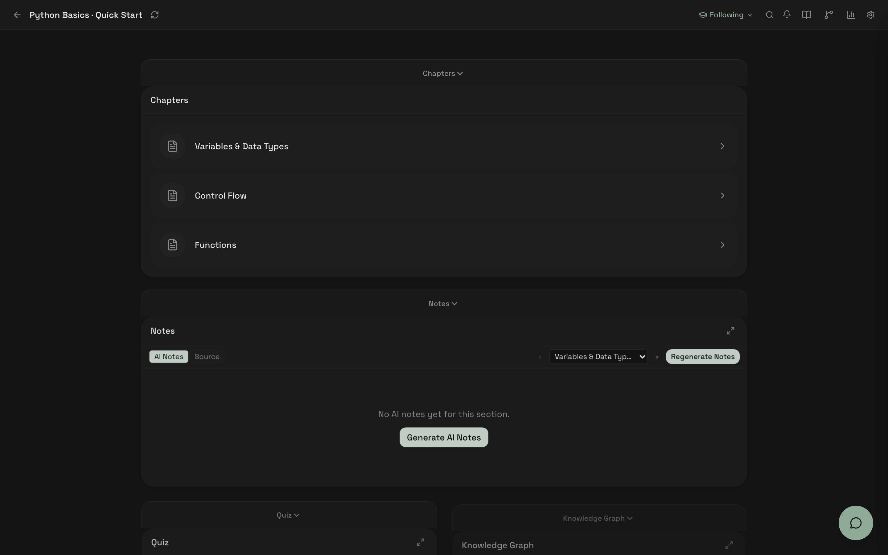
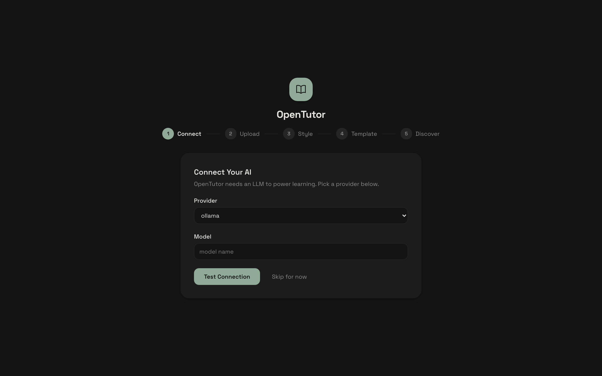
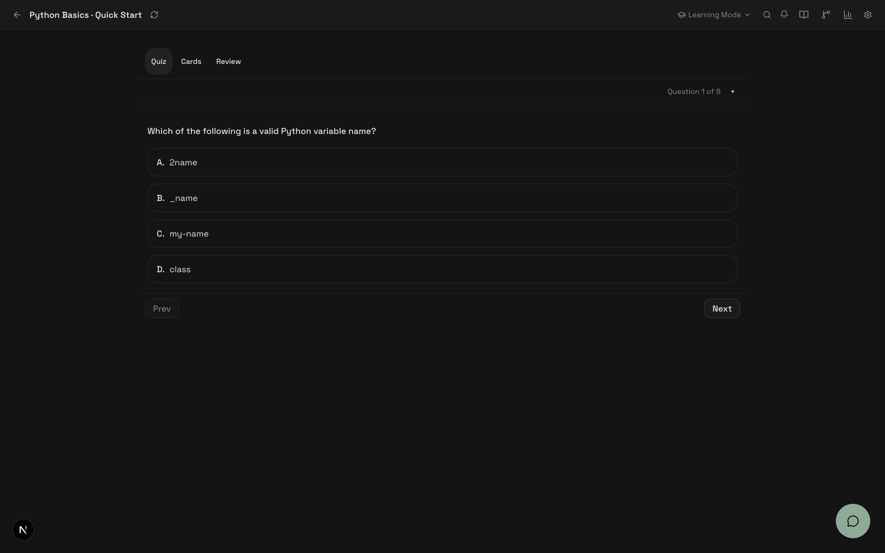
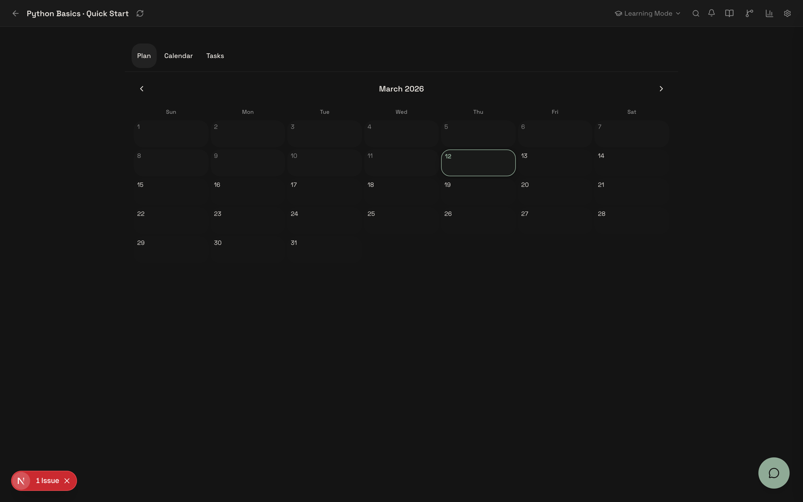

<div align="center">


# OpenTutor

**首个基于 Block 的自适应学习工作区，完全本地运行。**

上传一份 PDF，获得一个真正能适应*你*学习方式的 AI 导师。

[](LICENSE)
[](https://www.python.org/)
[](https://nextjs.org/)
[](https://www.docker.com/)
[](CONTRIBUTING.md)

[English](./README.md) | **中文**

</div>

<p align="center"></p>

## 痛点

我们试过的每个 AI 学习工具都有同样的问题：它们对每个学生一视同仁。相同的解释、相同的节奏、相同的题目。而且全都要把你的数据上传到云端。

## 解决方案

OpenTutor 是一个**自托管、本地优先**的 AI 学习平台。上传你的课程资料，30 秒内自动生成结构化笔记、闪卡、测验和 AI 导师 —— 全部在你的电脑上运行，完全免费。

核心差异：

- **Block 工作区**根据你的学习行为自动重组
- **本地运行**开源 LLM —— 无需 API Key，数据不离开你的电脑
- **基于学习科学** —— FSRS 间隔重复、知识图谱、认知负荷检测

```
上传 → AI 教学 → 你练习 → AI 记忆 → AI 提醒 → 循环
```

## 快速开始

### 3 行命令搞定

```bash
git clone https://github.com/zijinz456/OpenTutor.git && cd OpenTutor
cp .env.example .env
docker compose up -d --build
```

打开 [http://localhost:3001](http://localhost:3001)。完成。

> 没有 Docker？用 `bash scripts/quickstart.sh` —— 自动处理 Python 虚拟环境、npm 安装、数据库初始化，并启动前后端服务。

### 一键云部署

[](https://render.com/deploy?repo=https://github.com/zijinz456/OpenTutor)
[](https://railway.com/template?referralCode=opentutor&repo=https://github.com/zijinz456/OpenTutor)

<details>
<summary><strong>手动安装（不用 Docker）</strong></summary>

```bash
# 后端
cd apps/api
python3 -m venv .venv && source .venv/bin/activate
pip install -r requirements-core.txt
uvicorn main:app --reload --port 8000

# 前端（另开终端）
cd apps/web && npm install && npm run dev
```

访问 [http://localhost:3001](http://localhost:3001)。

</details>

<details>
<summary><strong>平台支持</strong></summary>

| 平台 | 状态 |
|---|---|
| macOS (Apple Silicon / Intel) | 支持 |
| Linux (Ubuntu 22.04+) | 支持 |
| Windows | 社区支持 |

**前置要求：** Python 3.11+、Node.js 20+、Docker（可选）

</details>

> **安全提示：** 默认关闭认证，仅用于本地单用户。网络部署前请设置 `AUTH_ENABLED=true` 并配置 `JWT_SECRET_KEY`。详见 [SECURITY.md](SECURITY.md)。

## 功能特性

### Block 自适应工作区

12 种可组合的学习 Block —— 笔记、测验、闪卡、知识图谱、学习计划、数据分析等。工作区会自适应：AI 根据你的行为建议布局变更，随着使用逐步解锁高级功能。

<p align="center"></p>

### 带来源引用的 AI 导师

每个回答都基于你的学习资料。导师根据行为信号自适应深度 —— 疲劳检测、错误模式、消息简短度。支持苏格拉底式提问。

<p align="center"></p>

### 30 秒内容摄入

上传 PDF、DOCX、PPTX，或连接 Canvas LMS。自动生成结构化笔记、AI 闪卡和测验题。7 种题型：选择题、简答题、填空题、判断题、匹配题、排序题、编程题。

<p align="center"></p>

### 自适应测验与练习

AI 生成 7 种题型的测验。错题追踪与诊断反馈。难度根据你的表现自动调整。

<p align="center"></p>

### 学习计划与日历

日历视图规划学习日程，任务追踪与截止日期管理。

<p align="center"></p>

### 间隔重复（FSRS 4.5）

优化的免费间隔重复调度。追踪你正在遗忘的内容，主动提醒复习。

### 知识图谱（LOOM）`[实验性]`

追踪概念掌握度、前置知识关系和薄弱环节。基于 [LOOM](https://arxiv.org/abs/2511.21037)。从你的学习资料中提取概念、构建知识图谱、生成最优学习路径。

### 语义复习（LECTOR）`[实验性]`

在 FSRS 基础上引入知识图谱感知的复习优先级。基于 [LECTOR](https://arxiv.org/abs/2508.03275)。聚类相关概念协同复习，优先复习前置知识。

### 10+ LLM 提供商

默认使用 Ollama 本地运行。可切换至 OpenAI、Anthropic、DeepSeek、Gemini、Groq、vLLM、LM Studio、OpenRouter，或任何 OpenAI 兼容端点。

```bash
# 本地（免费，默认）
LLM_PROVIDER=ollama
LLM_MODEL=llama3.2:3b

# 云端（可选）
LLM_PROVIDER=deepseek
LLM_MODEL=deepseek-chat
DEEPSEEK_API_KEY=sk-...
```

完整列表见 [.env.example](.env.example)。

## 架构

```
OpenTutor/
├── apps/
│   ├── api/              # FastAPI 后端
│   │   ├── services/
│   │   │   ├── agent/              # 3 个专家 Agent（导师、规划、布局）
│   │   │   ├── ingestion/          # 内容处理管线
│   │   │   ├── llm/                # 多提供商 LLM 路由 + 熔断器
│   │   │   ├── search/             # 混合 BM25 + 向量 RAG
│   │   │   ├── spaced_repetition/  # FSRS 调度 + 闪卡
│   │   │   └── learning_science/   # BKT、难度选择、认知负荷
│   │   ├── routers/           # 42 个 API 路由模块
│   │   └── models/            # 27 个 SQLAlchemy ORM 模型
│   └── web/              # Next.js 16 前端
│       └── src/
│           ├── components/blocks/  # 12 种可组合学习 Block
│           ├── store/              # Zustand 状态管理
│           └── lib/block-system/   # Block 注册、模板、功能解锁
├── tests/                # pytest + Playwright E2E（187+ 测试）
└── docs/                 # PRD、SPEC、架构决策
```

### Agent 系统

3 个专家 Agent 由意图路由协调器统一调度：

| Agent | 职责 |
|-------|------|
| **导师** | 自适应深度教学、苏格拉底式提问、来源引用 |
| **规划** | 学习计划、目标追踪、截止日期管理 |
| **布局** | 根据活动上下文配置工作区 |

### 技术栈

| 层级 | 技术 |
|------|------|
| **前端** | Next.js 16、React 19、TypeScript、Tailwind CSS 4、Zustand、shadcn/ui |
| **后端** | FastAPI、Python 3.11+、Pydantic 2、SQLAlchemy 2（异步）、Alembic |
| **数据库** | SQLite（本地优先）、可选 PostgreSQL |
| **学习科学** | FSRS 4.5、BKT、LOOM、LECTOR、认知负荷理论 |
| **CI/CD** | GitHub Actions、Docker Compose、Playwright |

## 研究基础

OpenTutor 基于以下论文：

| 论文 | 应用方式 |
|------|---------|
| [LECTOR](https://arxiv.org/abs/2508.03275)（arxiv 2025） | 基于知识图谱关系的语义间隔重复 |
| [LOOM](https://arxiv.org/abs/2511.21037)（arxiv 2025） | 动态学习者记忆图谱，追踪概念掌握度 |
| [认知负荷 + DKT](https://www.nature.com/articles/s41598-025-10497-x)（Nature 2025） | 行为信号驱动的实时难度自适应 |
| [FSRS 4.5](https://github.com/open-spaced-repetition/fsrs4.5) | 优化的免费间隔重复调度 |

## 路线图

- [x] Block 自适应工作区（12 种 Block）
- [x] 多 Agent 导师系统（导师、规划、布局）
- [x] FSRS 4.5 间隔重复
- [x] Canvas LMS 集成
- [x] 10+ LLM 提供商支持
- [x] LOOM 知识图谱 — FSRS 衰减、跨课程链接、内容节点关联
- [x] LECTOR 语义复习 — 混淆对、前置知识排序、FSRS 集成
- [x] 认知负荷 — 12 信号检测、干预追踪、漂移检测
- [ ] 认知负荷权重自动调优（数据收集中）
- [ ] 移动端自适应工作区
- [ ] 多用户教室模式
- [ ] 自定义 Block 插件系统

详见[实验性功能状态矩阵](docs/experimental-status-matrix.md)。

## 参与贡献

我们在公开构建这个项目，欢迎协作者加入。无论你擅长学习科学、AI Agent、前端还是后端，都能找到参与方式。

```bash
# 运行测试
python -m pytest tests/ -q -k "not llm_router"

# E2E 测试（需要运行中的服务）
npx playwright test
```

查看 [good first issues](https://github.com/zijinz456/OpenTutor/labels/good%20first%20issue) 开始，或阅读 [CONTRIBUTING.md](CONTRIBUTING.md) 了解完整指南。

## 许可证

[MIT](LICENSE)

---

<div align="center">

**如果 OpenTutor 对你的学习有帮助，给个 Star 吧。**

[报告 Bug](https://github.com/zijinz456/OpenTutor/issues/new?template=bug_report.md) · [功能建议](https://github.com/zijinz456/OpenTutor/issues/new?template=feature_request.md) · [参与讨论](https://github.com/zijinz456/OpenTutor/discussions)

</div>
